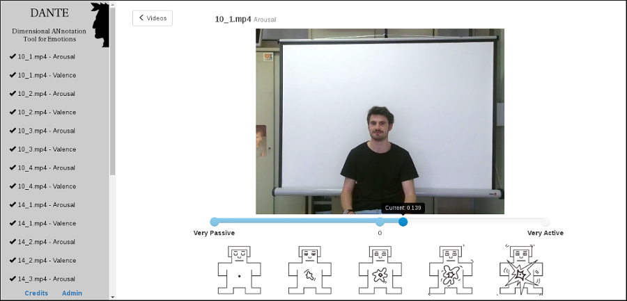

### Description
DANTE (Dimensional ANnotation Tool for Emotions) is a project developed by the [PHuSe Lab](http://phuselab.di.unimi.it "PHuSe Lab") from Università degli Studi di Milano, Italy, in collaboration with Département Informatique de Ecole Polytechnique de l'Université François Rabelais de Tours, France. The tool is part of a multimodal dataset acquired with the aim to study emotional response in presence of amusement stimulus.
For more information or to use the tool in other works, please refer to:

> Boccignone, G., Conte, D., Cuculo, V. and Lanzarotti, R. (2017) **AMHUSE: A Multimodal dataset for HUmour SEnsing**. In *Proceedings of 19th ACM International Conference on Multimodal Interaction.* (ICMI'17), ACM.  
DOI: [10.1145/3136755.3136806](http://doi.org/10.1145/3136755.3136806 "10.1145/3136755.3136806")

      

### Demo

For a test demo, go to the following link:

http://phuselab.di.unimi.it/DANTE/index.php?id=3497&vid=30_3.mp4&type=arousal

### Requirements
The annotation tool is a web-based software, and for this reason it simply requires a LAMP/MAMP/WAMP software bundle, depending on the operating system. In other terms, it requires: **Apache HTTP Server**, **MySQL** and **PHP**.

### Installation
- Clone the repository using `git clone https://github.com/PHuSeLab/DANTE.git`.
- Import in a MySQL database the file `annotationdb.sql`, which is responsible of the creation of all the needed tables.
- Edit the file `config.php` according to the environment. (For more details, see section [configuration](#config).
- Open the browser to the page `http://localhost/login.php` or wherever you installed DANTE.
- Login with default credentials `admin:admin`.
- Follow the configuration instructions and **change the default password**!

### Configuration
The configuration file contained in `config.php` is very simple and permits to configure some basics parameters, such as:
- `db_host` correspond to the hostname of the database (default: localhost).
- `db_name` correspond the database name to use and is the one where was imported the annotationdb.sql file (default: annotationdb).
- `db_user` database username.
- `db_pass` database password.
- `anno_rate` is the recording frequency of the annotation. DANTE will record a value every 1/anno_rate seconds (default: '25').
- `save_mode` DANTE is able to save the annotations to the database 'db' or to a text file 'file' (default: 'db').
